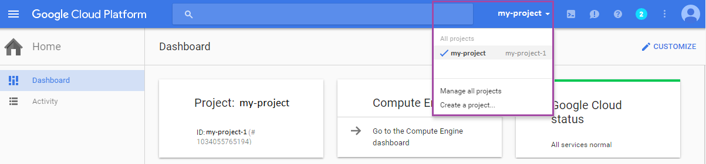
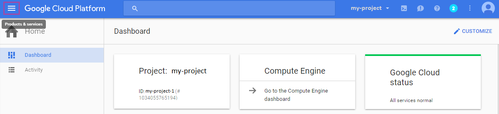
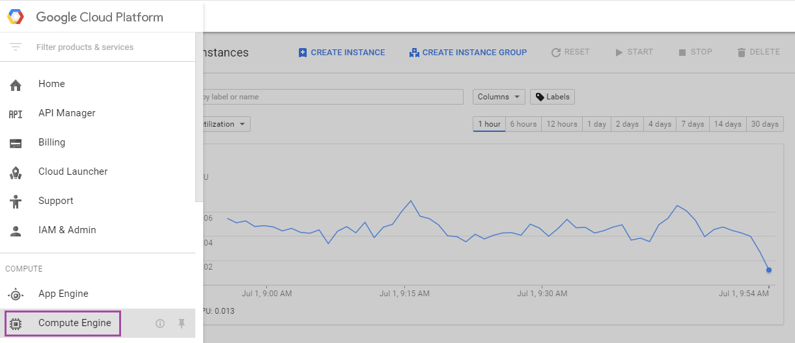
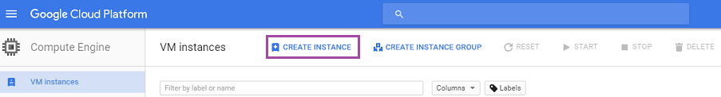
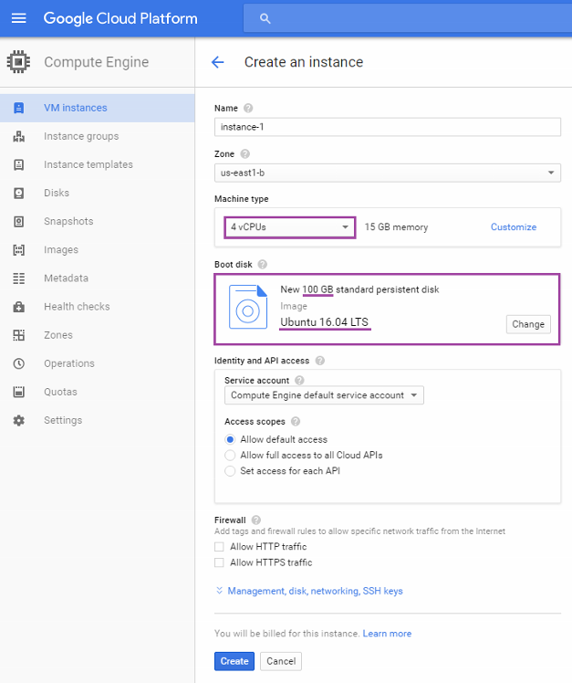
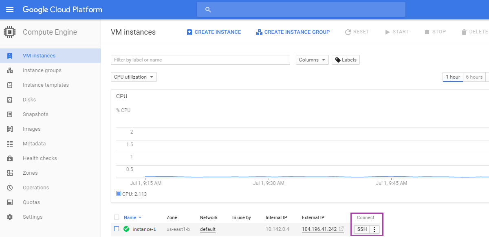
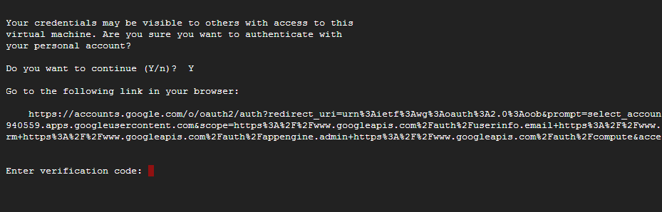

DISCONTINUATION OF PROJECT. 

This project will no longer be maintained by Intel.

This project has been identified as having known security escapes.

Intel has ceased development and contributions including, but not limited to, maintenance, bug fixes, new releases, or updates, to this project.  

Intel no longer accepts patches to this project.
# Status

This repository is no longer being actively maintained by Intel. Work has instead shifted to the [snap-integration-kubernetes](https://github.com/intelsdi-x/snap-integration-kubernetes) repository.

# kubesnap

## How to run
1. [Prerequisites](#1-prerequisites)  
2. [Start work with Google Cloud Platform](#2-start-work-with-google-cloud-platform)  
3. [Install kubesnap](#3-install-kubesnap)
4. [Contributing](#4-contributing)  
5. [License](#5-license)  
6. [Acknowledgements](#6-acknowledgements)  

### 1. Prerequisites

- **Kubernetes** cluster - tested with Kubernetes on Google Cloud Environment (GCE)

### 2. Start work with Google Cloud Platform

#### a) Open Google Cloud Platform Console
 - go to https://console.cloud.google.com/  
 - log in using your e-mail address
 - follow the instruction [how to create a Cloud Platform Console project](https://cloud.google.com/storage/docs/quickstart-console)


#### b) Select your project  
- select your project from the drop-down menu in the top right corner
    

#### c) Switch to _**Compute Engine**_ screen

- select _Products & Services_ from GC Menu in the top left corner  

   

- and then select _Compute Engine_ from the drop-down list

  

#### d) Create a new VM instance  
- create a new VM instance
    

- set the instance name
- choose a machine with at least 4 vCPUs and at least 15GB RAM
- select Ubuntu 16.04 with standard persistent disk with at least 100GB

    

#### e) Open the VM terminal by click on SSH  
 -  click on SSH to open the VM terminal (it will open as a new window)

   

#### f) Authorize access to Google Cloud Platform  
- manage credentials for the Google Cloud SD. To do that, run the following command:
  ```
  gcloud auth login
  ```
  Answer `Y` to the question (see below) and follow the instructions:
  -	copy the link in your browser and 
  -	authenticate with a service account which you use in Google Cloud Environment,
  - copy the verification code from browser window and enter it

  

- check if you are on credentialed accounts:  
 ```
 gcloud auth list
 ```


### 3. Install kubesnap  
Clone kubesnap into your home directory:
```
git clone https://github.com/intelsdi-x/kubesnap
```

Go to kubesnap/tools:
```
cd kubesnap/tools
```

Provision kubesnap (it takes approximately 35 minutes on a VM with 4 vCPUs and 15 GB of RAM in us-central1-b zone):
```
./provision-kubesnap.sh
```

### 4. Contributing
We love contributions!

There's more than one way to give back, from examples to blogs to code updates. See our recommended process in [CONTRIBUTING.md](CONTRIBUTING.md).

And **thank you!** Your contribution, through code and participation, is incredibly important to us.

### 5. License
[snap](http://github.com/intelsdi-x/snap), along with this kubesnap, is an Open Source software released under the Apache 2.0 [License](LICENSE).

### 6. Acknowledgements
* Authors: [Izabella Raulin](https://github.com/IzabellaRaulin),  [Marcin Olszewski](https://github.com/marcintao),  [Marcin Krolik](https://github.com/marcin-krolik), [Andrzej Kuriata](https://github.com/andrzej-k/)
